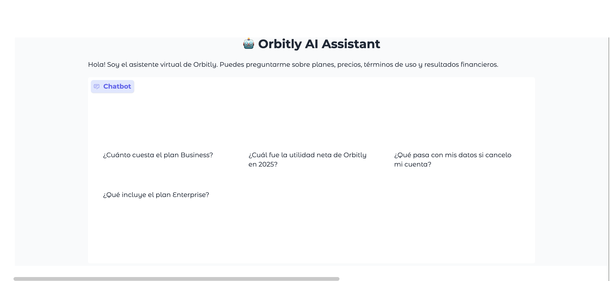
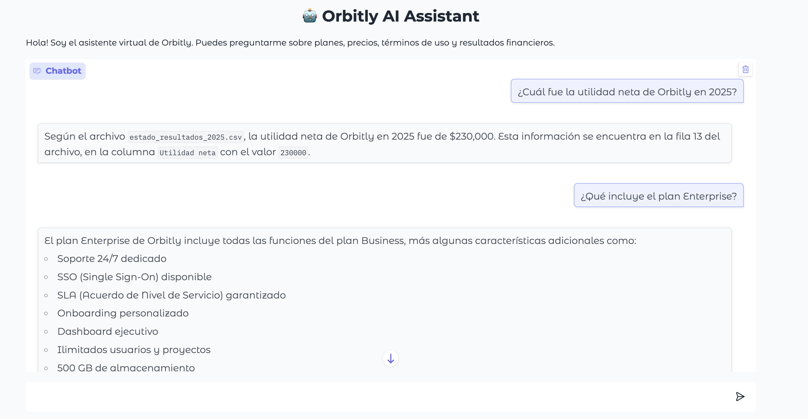
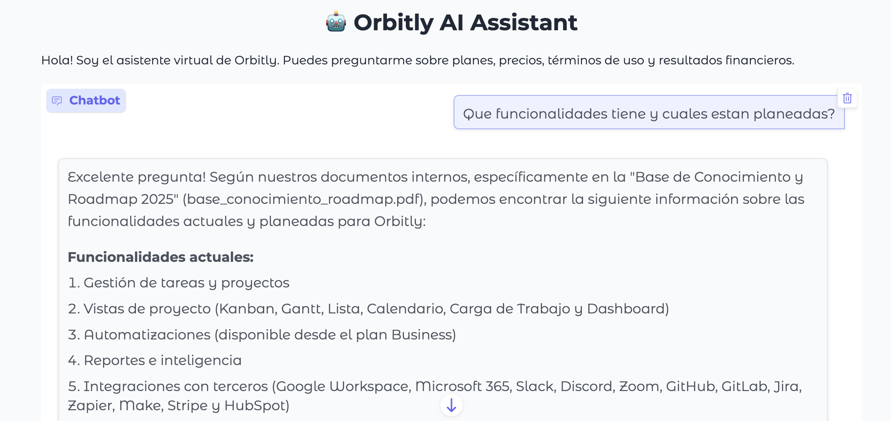

# Orbitly AI Assistant

Agente de inteligencia artificial corporativo para **Orbitly**, una plataforma SaaS de gestión de proyectos. El agente responde preguntas de los colaboradores basándose en documentos internos de la empresa.

## Descripción

Este proyecto fue desarrollado como parte del Challenge AluraAgente - ONE IA FOR TECH. El asistente puede responder preguntas sobre planes y precios, resultados financieros, términos de uso y la base de conocimiento del producto.

## Arquitectura
Usuario hace una pregunta

↓

Interfaz Gradio (chat visual)

↓

Agente LangGraph procesa la pregunta

↓

LLM Llama 3.3 (via Groq) busca en los documentos

↓

Respuesta al usuario

## Tecnologías utilizadas

- **LangGraph** — estructura y flujo del agente
- **LangChain** — conexión entre componentes
- **Groq + Llama 3.3 70b** — modelo de lenguaje
- **Gradio** — interfaz visual de chat
- **pdfplumber** — lectura de archivos PDF
- **pandas** — lectura de archivos CSV
- **Python 3.12** — lenguaje de programación
- **Oracle Cloud (OCI)** — plataforma de deploy

## Documentos internos de Orbitly

| Archivo | Formato | Contenido |
|---|---|---|
| base_conocimiento_roadmap.pdf | PDF | Funcionalidades y roadmap 2025 |
| terminos_de_uso.pdf | PDF | Términos legales y condiciones |
| planes_precio.csv | CSV | Planes y precios de suscripción |
| estado_resultados_2025.csv | CSV | Resultados financieros 2025 |

## Cómo ejecutar el proyecto

1. Abre el archivo `agente_orbitly.ipynb` en Google Colab
2. Agrega tu API key de Groq en Secrets con el nombre `GROQ_API_KEY`
3. Corre todas las celdas en orden
4. Usa el link de Gradio que aparece al final para interactuar con el agente

## Ejemplos de preguntas

- ¿Cuánto cuesta el plan Business de Orbitly?
- ¿Cuál fue la utilidad neta total en 2025?
- ¿Qué pasa con mis datos si cancelo mi cuenta?
- ¿Qué funcionalidades incluye Orbitly?
- ¿Qué hay planeado para Q4 2025?
- ¿Qué plan incluye soporte 24/7?

## Demo

## Deploy en OCI
Link:
